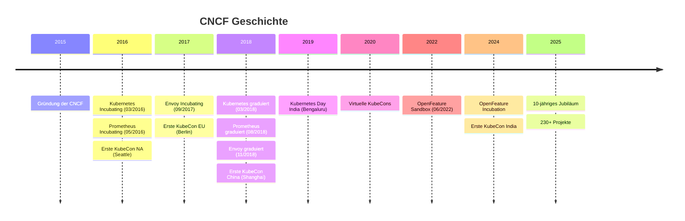
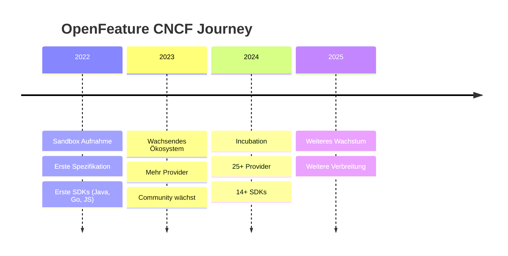

# CNCF Demystified

## Struktur, Funktion und Relevanz

 

Cloud Native Münster

  Lukas Reining

<!--
Willkommen beim allerersten Cloud Native Münster Meetup!
Ich freue mich, dass ihr hier seid.
Heute geht es darum, was die CNCF eigentlich ist, warum sie für uns als Entwickler relevant ist,
und ich nehme euch mit in die Perspektive von jemandem, der aktiv an einem CNCF-Projekt mitarbeitet.
-->

---
layout: center
---

# Wer bin ich?

 

- **Lukas Reining**
- IT-Consultant & Entwickler bei codecentric 
- Technical Committee Member & Maintainer bei **OpenFeature** (CNCF Incubating)
- Nutzer von CNCF-Technologien und Projekt-Maintainer -- hier um meine Perspektive zu teilen

<!--
Kurz zu mir: Ich bin Lukas, sitze im Technical Committee von OpenFeature,
einem CNCF Incubating Projekt. Ich erzähle euch das Ganze aus der Perspektive
von jemandem, der CNCF-Technologien nutzt und aktiv an einem CNCF-Projekt mitarbeitet.
-->

---

# Agenda

 

1. Was ist "Cloud Native"?
2. Was ist die CNCF?
3. Wie ist die CNCF organisiert?
4. Das Projekt-Lifecycle: Sandbox -> Incubating -> Graduated
5. Was bekommt ein Projekt von der CNCF?
6. OpenFeature -- ein Praxisbeispiel
7. Community Groups & dieses Meetup
8. Wie kann ich mitmachen?

<!--
Das ist unser Plan für heute.
Wir fangen ganz grundlegend an und arbeiten uns dann in die Details vor.
-->

---

# Was ist "Cloud Native"?

 

> Cloud native technologies empower organizations to build and run **scalable applications** in modern, dynamic environments such as public, private, and hybrid clouds.

> **Containers, service meshes, microservices, immutable infrastructure, and declarative APIs** exemplify this approach.

-- <a href="https://github.com/cncf/toc/blob/main/DEFINITION.md" target="_blank">CNCF Cloud Native Definition</a>

<!--
Das ist die offizielle Definition der CNCF.
Cloud Native ist kein einzelnes Produkt -- es ist ein Ansatz, wie wir Software bauen und betreiben.
Container, Kubernetes, Service Meshes, deklarative APIs -- all das sind Bausteine dieses Ansatzes.
Das Ziel: Systeme, die resilient, skalierbar und automatisierbar sind.
-->

---

# Was ist die CNCF?

 

Die **Cloud Native Computing Foundation** ist...

- Teil der **Linux Foundation** (Non-Profit)
- Gegründet **2015** (zusammen mit Kubernetes als erstem Projekt)
- Veranstalter der **KubeCon + CloudNativeCon**

<!--
Die CNCF ist keine Firma -- sie ist eine Stiftung innerhalb der Linux Foundation.
Ihr Ziel: Cloud-Native-Technologie überall verfügbar machen.
Sie wurde 2015 zusammen mit Kubernetes gegründet und ist seitdem enorm gewachsen.
-->

---

# 10 Jahre CNCF

Quellen: <a href="https://www.cncf.io/reports/cncf-annual-report-2025/" target="_blank">CNCF Annual Report 2025</a>, <a href="https://www.cncf.io/about/who-we-are/" target="_blank">cncf.io</a>

<!--
Ein kurzer Blick auf die Geschichte.
2015 wurde die CNCF zusammen mit Kubernetes gegründet -- Google hat Kubernetes der Foundation gespendet.
2016 kam Prometheus dazu und die erste KubeCon fand in Seattle statt.
2017 gab es die erste KubeCon EU in Berlin und Projekte wie Envoy, containerd und gRPC traten bei.
2018 war ein Meilensteinjahr: Kubernetes, Prometheus und Envoy graduierten als die ersten drei Projekte,
und die erste KubeCon China in Shanghai machte die Konferenz global.
2019 gab es den ersten Kubernetes Day India in Bengaluru.
2022 kam unter anderem OpenFeature als Sandbox-Projekt dazu.
Und 2024-25 bekam Indien seine eigene KubeCon und die CNCF feierte ihr 10-jähriges Jubiläum mit über 230 Projekten.
-->

---

# Die CNCF in Zahlen

Quelle: <a href="https://www.cncf.io/about/who-we-are/" target="_blank">cncf.io/about/who-we-are</a> (Stand: Februar 2026)

<!--
Die Zahlen sind beeindruckend -- über 218 Projekte, über 300.000 Contributors, über 700 Mitglieder.
Das ist ein Screenshot direkt von der CNCF-Website.
-->

---

  <iframe src="https://landscape.cncf.io/?group=projects&project=graduated&project=incubating" style="width: 200%; height: 200%; border: none; transform: scale(0.5); transform-origin: 0 0;" />

<a href="https://landscape.cncf.io/" target="_blank" class="text-sm opacity-50 absolute bottom-4 right-6">landscape.cncf.io</a>

<!--
Das hier ist die Cloud Native Landscape -- eine interaktive Karte aller Projekte und Produkte im Cloud-Native-Ökosystem.
Über 1000 Einträge, kategorisiert nach Bereichen wie App Definition, Orchestration, Runtime, Observability und mehr.
Die CNCF-Projekte sind ein besonders gut ausgetretener Pfad durch diese Landschaft.
Ich zeige euch das hier vor allem als visuellen Eindruck -- die Größe dieses Ökosystems ist beeindruckend.
-->

---

# Die Mission

 

> "CNCF's mission is to **make cloud native computing ubiquitous**."

-- <a href="https://github.com/cncf/foundation/blob/master/charter.md" target="_blank">CNCF Charter</a>

 

### Konkret bedeutet das:

- **Neutrale Heimat** für Open-Source-Projekte bieten
- **Vendor-neutral** bleiben -- kein Unternehmen kontrolliert ein Projekt allein
- **Interoperabilität** zwischen Projekten fördern
- **Community** aufbauen und unterstützen

<!--
Die Mission klingt einfach, aber was steckt dahinter?
Vendor-Neutralität ist das Kernprinzip. Wenn ein Unternehmen ein Projekt der CNCF spendet,
gibt es die Kontrolle ab. Das Projekt gehört der Community.
Das ist ein riesiger Vertrauensvorschuss -- und genau das macht die CNCF wertvoll.
-->

---
layout: two-cols
---

# Governance

 

**Governing Board (GB)**
- Mitgliedsunternehmen
- Marketing & Budget
- Strategische Richtung

 

**Technical Oversight Committee (TOC)**
- Technische Vision
- Projekt-Aufnahme & Beförderung
- Community Leadership

::right::

  

**End User TAB**
- Stimme der Endnutzer
- Feedback aus der Praxis

 

**TAGs** (Technical Advisory Groups)
- Security & Compliance
- App Delivery
- Runtime
- Networking
- Observability
- u.v.m.

<!--
Die CNCF hat eine klare Governance-Struktur.
Das Governing Board kümmert sich um Business und Budget.
Das TOC -- Technical Oversight Committee -- ist das technische Herz: es entscheidet, welche Projekte aufgenommen werden
und wie sie sich weiterentwickeln.
Die TAGs sind Arbeitsgruppen zu bestimmten Themen -- Security, Networking, Observability und so weiter.
Und das End User TAB bringt die Stimme der Nutzer ein.
-->

---

# Der Projekt-Lifecycle

| Level | Bedeutung                                                           |
|-------|---------------------------------------------------------------------|
| **Sandbox** | Experimentell, Breaking Changes möglich                             |
| **Incubating** | Zunehmend stabil, nachgewiesene Nutzung durch mehrere "große" Adopter |
| **Graduated** | Höchste Reife, nachgewiesene Nutzung in Production                  |

Quelle: <a href="https://github.com/cncf/toc/blob/main/process/project-stages.png" target="_blank">github.com/cncf/toc</a>

<!--
Jedes CNCF-Projekt durchläuft einen Reifeprozess.
Das ist das offizielle Diagramm aus dem CNCF TOC Repository.
Sandbox ist der Einstieg -- experimentell, Breaking Changes sind möglich und erwartet.
Incubating heißt: Das Projekt wird stabiler, und mindestens 3 unabhängige Adopter nutzen es -- in dev/test oder production.
Graduated ist die Krönung -- höchste Reife, und die Nutzung in Production wurde durch Adopter explizit nachgewiesen.
Und ja, es gibt auch Archived -- Projekte, die ihren Zweck erfüllt haben oder inaktiv geworden sind.
Wie lange das dauert, variiert stark. OpenFeature zum Beispiel war ca. 2 Jahre in Sandbox, bevor wir Incubation erreicht haben.
-->

---

# Was braucht ein Projekt für Incubation?

 

- **Verbreitung**: Einsatz bei mehreren unabhängigen Organisationen
- **Governance**: Dokumentiert und vendor-neutral
- **Maintainer**: Aktiv, aus verschiedenen Unternehmen
- **Community**: Contributor-Ladder, öffentliche Kanäle, regelmäßige Meetings
- **Security**: OpenSSF Best Practices Badge, Security-Prozesse
- **Engineering**: Dokumentierte Roadmap, regelmäßige Releases

Das TOC bewertet das Gesamtbild -- kein reines Checkboxen-Abhaken.

Quelle: <a href="https://github.com/cncf/toc/blob/main/.github/ISSUE_TEMPLATE/template-incubation-application.md" target="_blank">CNCF TOC -- Incubation Application Template</a>

<!--
Was muss ein Projekt mitbringen, um von Sandbox zu Incubating zu kommen?
Es ist eine umfangreiche Liste. Verbreitung, Governance, Security, Community -- alles wird geprüft.
Das TOC schaut sich das Gesamtbild an. Es geht nicht nur darum, ob der Code gut ist,
sondern ob das Projekt nachhaltig, offen und vendor-neutral geführt wird.
-->

---
layout: center
---

# Was bekommt ein Projekt von der CNCF?

<!--
Aber was hat ein Projekt eigentlich davon, Teil der CNCF zu sein?
-->

---
layout: two-cols
---

# CNCF Project Services

 

**Code Analysis & Audits**
- Fuzzing, Security-Audits

**Hosted Tools & Infrastruktur**
- CI/CD, Cloud-Credits (AWS, GCP, ...)
- Slack, Zoom, Netlify, Domains

**CNCF Support**
- Program Management & Legal
- Design, Internationalization

::right::

  

**Marketing Services**
- Blog, Webinars, Case-Studies
- Press & Social Media

**Event Services**
- KubeCon Slots & Project Pavilion
- Co-located Events, Travel-Funding

**Technical Writing**
- Dokumentationsanalyse
- Tech-Writers & Office-Hours

Quelle: <a href="https://contribute.cncf.io/resources/services/" target="_blank">contribute.cncf.io/resources/project-services</a>

<!--
Das sind die offiziellen Project Services der CNCF -- direkt von contribute.cncf.io.
Sechs Kategorien: Von Security-Audits über CI/CD und Cloud-Credits bis hin zu Marketing und Technical Writing.
Für ein junges Projekt ist das ein enormer Vorteil -- das müsste man sonst alles selbst organisieren und bezahlen.
-->

---
layout: center
class: text-center
---

# Praxisbeispiel: OpenFeature

 

Ein Blick hinter die Kulissen eines CNCF-Projekts

<!--
Jetzt wird es konkret.
Ich nehme euch mit in die Welt von OpenFeature -- einem Projekt, an dem ich aktiv mitarbeite.
-->

---

# Was ist OpenFeature?

 

> **Mission**: "To improve the software development lifecycle by **standardizing feature flagging** for everyone."

-- <a href="https://openfeature.dev/community/mission-vision" target="_blank">openfeature.dev/community/mission-vision</a>

 

- **CNCF Incubating** Projekt
- **Offene Spezifikation** für Feature-Flags
- **OFREP** -- offenes Protokoll zur Kommunikation mit Feature-Flagging-Systemen
- **Vendor-agnostisch** -- funktioniert mit jedem Feature-Flagging-System
- SDKs für Java, Go, .NET, JS/TS, Python, PHP, Ruby, Kotlin, Swift, Rust, ...

<!--
OpenFeature ist ein offener Standard für Feature-Flags.
Feature-Flags kennt ihr vielleicht -- damit kann man Features ein- und ausschalten, ohne neuen Code zu deployen.
Das Problem: Jeder Anbieter hat sein eigenes SDK, seine eigene API.
OpenFeature standardisiert das -- ein SDK, jeder Anbieter dahinter austauschbar.
Und mit OFREP -- dem OpenFeature Remote Evaluation Protocol -- gibt es auch ein offenes Protokoll,
über das SDKs direkt mit Feature-Flagging-Systemen kommunizieren können, ohne anbieterspezifische Provider.
-->

---

# Warum Feature-Flags in Cloud-Native-Systemen?

 

- **Entkopplung von Deployment und Release** -- deployen ohne zu releasen
- **Progressive Delivery** -- Canary-Releases, Ring-Deployments, Prozent-Rollouts
- **Resilience** -- Features im laufenden Betrieb abschalten, ohne Rollback
- **Trunk-based Development** -- alle arbeiten auf einem Branch, Features hinter Flags
- **Experimentation** -- A/B-Tests und datengetriebene Entscheidungen in Production

 

In verteilten Systemen mit häufigen Deployments sind Feature-Flags kein Nice-to-have, sondern **Infrastruktur**.

<!--
Warum ist das relevant für Cloud Native?
In Cloud-Native-Systemen deployen wir häufig -- mehrmals am Tag.
Feature-Flags erlauben es, Deployment und Release zu entkoppeln.
Ihr könnt Code deployen, ohne dass der Nutzer ihn sofort sieht.
Ihr könnt Features schrittweise ausrollen -- erst 1%, dann 10%, dann alle.
Und wenn etwas schiefgeht, schaltet ihr das Feature ab -- ohne Rollback, ohne neues Deployment.
In verteilten Systemen mit Microservices ist das kein Luxus, sondern Infrastruktur.
-->

---

# Das Ökosystem: SDKs

  <iframe src="https://openfeature.dev/ecosystem/?instant_search%5BrefinementList%5D%5Btype%5D%5B0%5D=SDK" style="width: 200%; height: 200%; border: none; transform: scale(0.5); transform-origin: 0 0;" />

<a href="https://openfeature.dev/ecosystem" target="_blank" class="text-sm opacity-50 absolute bottom-4 right-6">openfeature.dev/ecosystem</a>

<!--
Hier seht ihr das OpenFeature Ökosystem -- über 14 SDKs für praktisch jede relevante Sprache.
Von serverseitig mit Java, Go, .NET bis hin zu clientseitig mit React und Angular.
Und daneben über 25 Provider von verschiedenen Feature-Flag-Anbietern.
-->

---

# Der Weg von OpenFeature

 

Quellen: <a href="https://openfeature.dev" target="_blank">openfeature.dev</a>, <a href="https://github.com/cncf/toc" target="_blank">CNCF TOC Records</a>

<!--
OpenFeature wurde 2022 als Sandbox-Projekt aufgenommen.
In zwei Jahren haben wir es zu Incubation geschafft.
Das zeigt, dass das Modell funktioniert -- und dass die Community der Treiber ist.
-->

---

# Case Study: Synergien von CNCF Projekten

TBD: OpenFeature und OTEL zusammenarbeit bei FF SemConv

---

# Wie fühlt es sich an, in einem CNCF-Projekt zu sein?

 

Das CNCF-Label **öffnet Türen** -- Sichtbarkeit, Vertrauen, Zugang zu einer globalen Community.

Man bekommt echten **Support**: Security-Audits, Legal, Infrastruktur.

Man **lernt** enorm -- Governance, Community-Building, Zusammenarbeit über Firmengrenzen hinweg.

 

Aber: **Prozesse** kosten Zeit. **Vendor-Neutralität** ist harte Arbeit.

Mehr Nutzer bedeuten mehr **Verantwortung**. Konsens ist nicht immer möglich -- und genau dafür braucht es **Governance**, um einen Konsent zu finden.

<!--
Die Sichtbarkeit ist enorm. Wenn dein Projekt das CNCF-Label trägt, nehmen Leute es ernst.
Die Community ist international und divers -- verschiedene Firmen, verschiedene Perspektiven.
Und der Support der CNCF ist real: Security-Audits, Rechtsberatung, Cloud-Credits.
Aber es ist nicht alles rosarot. Die Prozesse sind gründlich -- aber sie kosten Zeit.
Vendor-Neutralität zu wahren ist harte Arbeit, und mehr Nutzer bedeuten mehr Verantwortung.
-->

---
layout: center
---

# Von einem Projekt zur ganzen Community

 

OpenFeature ist **ein** Beispiel. Aber die CNCF lebt von **hunderten** Projekten -- und von den Menschen dahinter.

Wie könnt **ihr** Teil davon werden?

<!--
Wir haben jetzt gesehen, wie es sich anfühlt, in einem CNCF-Projekt zu sein.
Aber das ist nur ein kleiner Ausschnitt. Die CNCF lebt von der Community -- lokal und global.
Und genau deshalb sind wir heute hier.
-->

---

# Cloud Native Community Groups

 

- **Offizielle lokale Chapters** der CNCF
- Über **146.000+** Community Members weltweit
- Organisiert über **community.cncf.io**
- Inklusive **Kubernetes Community Days (KCDs)**

Quelle: <a href="https://www.cncf.io/about/who-we-are/" target="_blank">cncf.io/about/who-we-are</a> & <a href="https://community.cncf.io" target="_blank">community.cncf.io</a>

<!--
Cloud Native Community Groups sind das lokale Rückgrat der CNCF.
Es gibt sie überall auf der Welt -- von San Francisco bis Bangalore, von Berlin bis São Paulo.
Und jetzt auch in Münster.
-->

---

# Cloud Native Münster

 

- Brandneues Chapter -- **ihr seid dabei!**
- Teil des globalen CNCF Community-Netzwerks
- Lokaler Austausch über Cloud-Native-Themen
- Offizielles CNCF Community Chapter

<!--
Dieses Meetup ist offiziell ein CNCF Chapter.
Ihr seid Teil von etwas Großem.
Und das Beste: Wir fangen gerade erst an.
-->

---
layout: center
---

# Wie kann ich mitmachen?

<!--
Und jetzt die wichtigste Frage: Wie könnt ihr mitmachen?
-->

---

# Mitmachen: Als Nutzer & Contributor

 

### Als Nutzer:
- CNCF-Projekte einsetzen und **Feedback geben**
- **Issues melden**, Dokumentation verbessern

 

### Als Contributor:
- **Code beitragen** -- auch kleine Fixes zählen
- An **Community-Meetings** teilnehmen
- **contribute.cncf.io** als Startpunkt nutzen

<!--
Es gibt so viele Wege mitzumachen.
Man muss kein Kubernetes-Experte sein. Ein Bugreport, eine Docs-Verbesserung, eine Frage im Slack --
alles zählt.
-->

---

# Mitmachen: Community & Speaking

 

### Als Community-Mitglied:
- **Zu diesem Meetup kommen!**
- Beim CNCF Slack mitmachen (**slack.cncf.io**)
- KubeCon besuchen (Amsterdam, 23.--26. März 2026!)

 

### Als Speaker:
- Einen **Talk** bei einem Community-Meetup halten
- Beim **CFP** der KubeCon einreichen

<!--
Und das Schönste: Ihr seid schon dabei, indem ihr heute hier seid.
Wer Lust hat, hier einen Talk zu halten -- meldet euch!
-->

---
layout: center
---

# Warum brauchen wir die CNCF?

 

Unsere Infrastruktur baut auf Open Source. Aber Open Source allein reicht nicht.

Wir brauchen Projekte, die **unabhängig** sind -- nicht von einem einzelnen Unternehmen kontrolliert.

Wir brauchen Projekte, die **verlässlich** sind -- mit klarer Governance, Security-Prozessen und einer aktiven Community.

Wir brauchen Projekte, die **überleben** -- auch wenn sich Firmen zurückziehen, Teams wechseln oder Prioritäten sich ändern.

**Die CNCF macht genau das möglich.**

<!--
Das ist mein Kernpunkt.
Wir bauen unsere kritischste Infrastruktur auf Open Source.
Aber ein GitHub-Repo mit einer MIT-Lizenz ist noch kein verlässliches Fundament.
Was passiert, wenn der Maintainer aufhört? Wenn die Firma dahinter die Richtung ändert?
Die CNCF sorgt für Vendor-neutrale Governance, für Struktur, für Nachhaltigkeit.
Sie stellt sicher, dass Projekte der Community gehören -- nicht einer Firma.
Und genau das brauchen wir, wenn wir unsere Systeme darauf bauen.
-->

---
layout: center
class: text-center
---

# Danke!

 

Fragen?

 

  Cloud Native Münster -- CNCF Community Chapter

<!--
Danke für eure Aufmerksamkeit!
Ich freue mich auf eure Fragen.
-->
