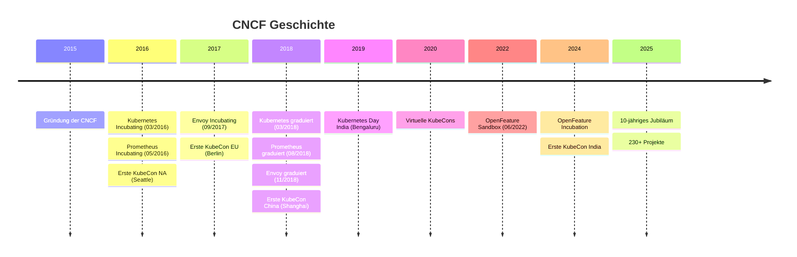
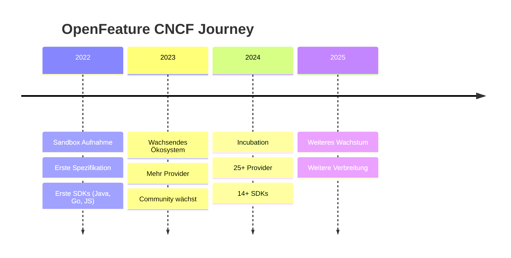

# Kubernetes war der Anfang

## Die CNCF und warum sie relevant ist

<!--
- Willkommen beim ersten Cloud Native Münster Meetup
- Heute: Was ist die CNCF, warum relevant, wie funktioniert sie
- Meine Perspektive als CNCF-Projekt-Maintainer
-->

---
layout: center
---

# Wer bin ich?

 

- **Lukas Reining**
- IT-Consultant & Entwickler bei codecentric 
- Technical Committee Member & Maintainer bei **OpenFeature** (CNCF Incubating)
- Nutzer von CNCF-Technologien und Projekt-Maintainer -- hier um meine Perspektive zu teilen

<!--
- Lukas, IT-Consultant bei codecentric
- Technical Committee bei OpenFeature (CNCF Incubating)
- Perspektive: CNCF-Nutzer und Projekt-Maintainer
-->

---

# Agenda

 

1. Was ist "Cloud Native"?
2. Was ist die CNCF?
3. Wie ist die CNCF organisiert?
4. Das Projekt-Lifecycle: Sandbox -> Incubating -> Graduated
5. Was bekommt ein Projekt von der CNCF?
6. OpenFeature -- ein Praxisbeispiel
7. Community Groups & dieses Meetup
8. Wie kann ich mitmachen?

<!--
- Plan für heute
- Grundlagen -> Details -> Praxis -> Mitmachen
-->

---

# Was ist "Cloud Native"?

 

> Cloud native practices empower organizations to **develop, build, and deploy workloads** in computing environments (**public, private, hybrid cloud**) to meet their organizational needs at scale in a **programmatic and repeatable manner**. 
> It is characterized by **loosely coupled systems** that interoperate in a manner that is **secure**, **resilient**, **manageable**, **sustainable**, and **observable**.
> Cloud native technologies and architectures typically consist of some combination of containers, service meshes, multi-tenancy, microservices, immutable infrastructure, serverless, and **declarative APIs** — this list is non-exhaustive.

> Combined with robust automation, cloud native practices allow organizations to make **high-impact changes frequently, predictably, with minimal toil** and clear separation of concerns.

-- <a href="https://github.com/cncf/toc/blob/main/DEFINITION.md" target="_blank">CNCF Cloud Native Definition</a>

<!--
- Offizielle CNCF-Definition
- Kein einzelnes Produkt, sondern ein Ansatz
- Bausteine: Container, K8s, Service Meshes, deklarative APIs
- Ziel: resilient, skalierbar, automatisierbar
-->

---

# Was ist die CNCF?

 

Die **Cloud Native Computing Foundation** ist...

- Teil der **Linux Foundation** (Non-Profit)
- Gegründet **2015** (zusammen mit Kubernetes als erstem Projekt)
- Veranstalter der **KubeCon + CloudNativeCon**

<!--
- Stiftung innerhalb der Linux Foundation, keine Firma
- 2015 zusammen mit Kubernetes gegründet
- Ziel: Cloud-Native-Technologie überall verfügbar machen
-->

---

# Die Mission

 

> "CNCF's mission is to **make cloud native computing ubiquitous**."

-- <a href="https://github.com/cncf/foundation/blob/master/charter.md" target="_blank">CNCF Charter</a>

 

### Konkret bedeutet das:

- **Neutrale Heimat** für Open-Source-Projekte bieten
- **Vendor-neutral** bleiben -- kein Unternehmen kontrolliert ein Projekt allein
- **Interoperabilität** zwischen Projekten fördern
- **Community** aufbauen und unterstützen

<!--
- Kernprinzip: Vendor-Neutralität
- Firma spendet Projekt -> gibt Kontrolle ab -> gehört der Community
- Genau das macht die CNCF wertvoll
-->

---

# 10 Jahre CNCF

Quellen: <a href="https://www.cncf.io/reports/cncf-annual-report-2025/" target="_blank">CNCF Annual Report 2025</a>, <a href="https://www.cncf.io/about/who-we-are/" target="_blank">cncf.io</a>

<!--
- 2015: Gründung, Google spendet K8s
- 2016: Prometheus, erste KubeCon Seattle
- 2017: KubeCon EU Berlin
- 2018: Erste 3 Graduations (K8s, Prometheus, Envoy) + KubeCon China
- 2022: OpenFeature Sandbox
- 2024-25: OF Incubation, KubeCon India, 10-jähriges Jubiläum
-->

---

# Die CNCF in Zahlen

Quelle: <a href="https://www.cncf.io/about/who-we-are/" target="_blank">cncf.io/about/who-we-are</a> (Stand: Februar 2026)

<!--
- Screenshot von cncf.io
- 218+ Projekte, 306K+ Contributors, 721+ Mitglieder
-->

---
hideFooter: true
---

  <iframe src="https://landscape.cncf.io/?group=projects&project=graduated&project=incubating" style="width: 200%; height: 200%; border: none; transform: scale(0.5); transform-origin: 0 0;" />

<a href="https://landscape.cncf.io/" target="_blank" class="text-sm opacity-50 absolute bottom-4 right-6">landscape.cncf.io</a>

<!--
- Cloud Native Landscape: Graduated + Incubating Projekte
- Visueller Eindruck der Größe des Ökosystems
-->

---
layout: two-cols
---

# Governance

 

**Governing Board (GB)**
- Mitgliedsunternehmen
- Marketing & Budget
- Strategische Richtung

 

**Technical Oversight Committee (TOC)**
- Technische Vision
- Projekt-Aufnahme & Beförderung
- Community Leadership

::right::

  

**End User Technical Advisory Board (TAB)**
- Stimme der Endnutzer
- Feedback aus der Praxis

 

**Technical Advisory Groups** (TAGs)
- Security & Compliance
- App Delivery
- Runtime
- Networking
- Observability
- u.v.m.

<!--
- GB: Business, Budget
- TOC: technisches Herz, entscheidet über Projekte
- TAGs: Arbeitsgruppen (Security, Networking, Observability, ...)
- End User TAB: Stimme der Nutzer
-->

---

# Der Projekt-Lifecycle

| Level | Bedeutung                                                           |
|-------|---------------------------------------------------------------------|
| **Sandbox** | Experimentell, Breaking Changes möglich                             |
| **Incubating** | Zunehmend stabil, nachgewiesene Nutzung durch mehrere "große" Adopter |
| **Graduated** | Höchste Reife, nachgewiesene Nutzung in Production                  |

Quelle: <a href="https://github.com/cncf/toc/blob/main/process/project-stages.png" target="_blank">github.com/cncf/toc</a>

<!--
- Offizielles Diagramm aus dem CNCF TOC Repo
- Sandbox: experimentell, Breaking Changes erwartet
- Incubating: stabiler, min. 3 Adopter (dev/test oder production)
- Graduated: höchste Reife, Production-Nutzung nachgewiesen
- Auch Archived möglich
- OpenFeature: ~2 Jahre Sandbox -> Incubation
-->

---

# Was braucht ein Projekt für Incubation?

 

- **Verbreitung**: Einsatz bei mehreren unabhängigen Organisationen
- **Governance**: Dokumentiert und vendor-neutral
- **Maintainer**: Aktiv, aus verschiedenen Unternehmen
- **Community**: Contributor-Ladder, öffentliche Kanäle, regelmäßige Meetings
- **Security**: OpenSSF Best Practices Badge, Security-Prozesse
- **Engineering**: Dokumentierte Roadmap, regelmäßige Releases

Das TOC bewertet das Gesamtbild -- kein reines Checkboxen-Abhaken.

Quelle: <a href="https://github.com/cncf/toc/blob/main/.github/ISSUE_TEMPLATE/template-incubation-application.md" target="_blank">CNCF TOC -- Incubation Application Template</a>

<!--
- Umfangreiche Kriterien: Verbreitung, Governance, Security, Community
- TOC bewertet Gesamtbild, nicht nur Code
- Projekt muss nachhaltig, offen, vendor-neutral geführt werden
-->

---
layout: center
---

# Was bekommt ein Projekt von der CNCF?

<!--
- Was hat ein Projekt davon, Teil der CNCF zu sein?
-->

---
layout: two-cols
---

# CNCF Project Services

 

**Code Analysis & Audits**
- Fuzzing, Security-Audits

**Hosted Tools & Infrastruktur**
- CI/CD, Cloud-Credits (AWS, GCP, ...)
- Slack, Zoom, Netlify, Domains

**CNCF Support**
- Program Management & Legal
- Design, Internationalization

::right::

  

**Marketing Services**
- Blog, Webinars, Case-Studies
- Press & Social Media

**Event Services**
- KubeCon Slots & Project Pavilion
- Co-located Events, Travel-Funding

**Technical Writing**
- Dokumentationsanalyse
- Tech-Writers & Office-Hours

Quelle: <a href="https://contribute.cncf.io/resources/services/" target="_blank">contribute.cncf.io/resources/project-services</a>

<!--
- 6 Kategorien offizieller Services
- Security-Audits, CI/CD, Cloud-Credits, Marketing, Technical Writing
- Enormer Vorteil für junge Projekte
-->

---
layout: center
class: text-center
---

# Praxisbeispiel: OpenFeature

 

Ein Blick hinter die Kulissen eines CNCF-Projekts

<!--
- Jetzt konkret: OpenFeature, ein Projekt an dem ich mitarbeite
-->

---

# Was ist OpenFeature?

 

> **Mission**: "To improve the software development lifecycle by **standardizing feature flagging** for everyone."

-- <a href="https://openfeature.dev/community/mission-vision" target="_blank">openfeature.dev/community/mission-vision</a>

 

- **CNCF Incubating** Projekt
- **Offene Spezifikation** für Feature-Flags
- **OFREP** -- offenes Protokoll zur Kommunikation mit Feature-Flagging-Systemen
- **Vendor-agnostisch** -- funktioniert mit jedem Feature-Flagging-System
- SDKs für Java, Go, .NET, JS/TS, Python, PHP, Ruby, Kotlin, Swift, Rust, ...

<!--
- Offener Standard für Feature-Flags
- Feature-Flags: Features ein-/ausschalten ohne neues Deployment
- Problem: jeder Anbieter eigenes SDK, eigene API
- OpenFeature: ein SDK, Anbieter austauschbar
- OFREP: offenes Protokoll, direkte Kommunikation ohne Provider
-->

---

# Warum Feature-Flags in Cloud-Native-Systemen?

 

- **Entkopplung von Deployment und Release** -- deployen ohne zu releasen
- **Progressive Delivery** -- Canary-Releases, Ring-Deployments, Prozent-Rollouts
- **Resilience** -- Features im laufenden Betrieb abschalten, ohne Rollback
- **Trunk-based Development** -- alle arbeiten auf einem Branch, Features hinter Flags
- **Experimentation** -- A/B-Tests und datengetriebene Entscheidungen in Production

 

In verteilten Systemen mit häufigen Deployments sind Feature-Flags kein Nice-to-have, sondern **Infrastruktur**.

<!--
- Cloud Native = häufige Deployments, mehrmals täglich
- Deployment ≠ Release
- Schrittweise ausrollen: 1% -> 10% -> alle
- Problem? Feature abschalten, kein Rollback nötig
- In Microservices: Infrastruktur, kein Luxus
-->

---
hide: true
---

# Das Ökosystem: SDKs

  <iframe src="https://openfeature.dev/ecosystem/?instant_search%5BrefinementList%5D%5Btype%5D%5B0%5D=SDK" style="width: 200%; height: 200%; border: none; transform: scale(0.5); transform-origin: 0 0;" />

<a href="https://openfeature.dev/ecosystem" target="_blank" class="text-sm opacity-50 absolute bottom-4 right-6">openfeature.dev/ecosystem</a>

<!--
- 14+ SDKs, praktisch jede relevante Sprache
- Server: Java, Go, .NET | Client: React, Angular
- 25+ Provider verschiedener Anbieter
-->

---

# Der Weg von OpenFeature

 

Quellen: <a href="https://openfeature.dev" target="_blank">openfeature.dev</a>, <a href="https://github.com/cncf/toc" target="_blank">CNCF TOC Records</a>

<!--
- 2022: Sandbox-Aufnahme
- 2 Jahre später: Incubation
- CNCF-Modell funktioniert, Community ist Treiber
-->

---

# Case Study: Synergien zwischen CNCF-Projekten

**OpenFeature** + **OpenTelemetry (OTEL)** haben gemeinsam die <a href="https://opentelemetry.io/docs/specs/semconv/feature-flags/feature-flags-events/" target="_blank">OTEL Semantic Conventions für Feature Flags</a> entwickelt.

 

### Was ist passiert?

- Gemeinsame OTEL **SIG** (Special Interest Group) aus beiden Projekten gegründet
- Standardisierte **Attribute** für Feature-Flag-Events definiert (z.B. `feature_flag.key`, `feature_flag.result.variant`)
- OpenFeature <a href="https://openfeature.dev/specification/appendix-d" target="_blank">Telemetry-Hooks</a> emittieren bei jeder Flag-Evaluierung automatisch OTEL-Events

 

### Das Ergebnis:

Feature Flagging wird **beobachtbar** -- mit standardisierter Telemetrie, die in jedes OTEL-kompatible Tool fließt.

Quellen: <a href="https://opentelemetry.io/docs/specs/semconv/feature-flags/feature-flags-events/" target="_blank">OTEL SemConv: Feature Flags</a>, <a href="https://openfeature.dev/specification/appendix-d" target="_blank">OF Appendix D</a>, <a href="https://openfeature.dev/blog/feature-observability-semantic-conventions" target="_blank">OF Blog</a>

<!--
- Zwei CNCF-Projekte arbeiten zusammen
- Gemeinsame SIG für Feature Flag Semantic Conventions
- OF definiert Spezifikation + SDKs, OTEL definiert Telemetrie-Format
- Appendix D: Mapping von OF-Feldern auf OTEL-Attribute
- Ergebnis: Feature-Flag-Evaluierungen standardisiert beobachtbar
- Zeigt: CNCF-Projekte schaffen Synergien, die allein nicht möglich wären
-->

---

# Wie fühlt es sich an, in einem CNCF-Projekt zu sein?

 

Das CNCF-Label **öffnet Türen** -- Sichtbarkeit, Vertrauen, Zugang zu einer globalen Community.

Man bekommt echten **Support**: Security-Audits, Legal, Infrastruktur.

Man **lernt** enorm -- Governance, Community-Building, Zusammenarbeit über Firmengrenzen hinweg.

 

Aber: **Prozesse** kosten Zeit. **Vendor-Neutralität** ist harte Arbeit.

Mehr Nutzer bedeuten mehr **Verantwortung**. Konsens ist nicht immer möglich -- und genau dafür braucht es **Governance**, um einen Konsent zu finden.

<!--
- CNCF-Label = Sichtbarkeit + Vertrauen
- Support: Security-Audits, Legal, Cloud-Credits
- Lernen: Governance, Community-Building, firmenübergreifend
- Aber: Prozesse kosten Zeit
- Vendor-Neutralität = harte Arbeit
- Kein Konsens möglich -> Governance schafft Konsent
-->

---
layout: center
---

# Von einem Projekt zur ganzen Community

 

OpenFeature ist **ein** Beispiel. Aber die CNCF lebt von **hunderten** Projekten -- und von den Menschen dahinter.

Wie könnt **ihr** Teil davon werden?

<!--
- OpenFeature = ein Ausschnitt
- CNCF lebt von der Community
- Deshalb sind wir heute hier
-->

---

# Cloud Native Community Groups

 

- **Offizielle lokale Chapters** der CNCF
- Über **146.000+** Community Members weltweit
- Organisiert über **community.cncf.io**
- Inklusive **Kubernetes Community Days (KCDs)**

Quelle: <a href="https://www.cncf.io/about/who-we-are/" target="_blank">cncf.io/about/who-we-are</a> & <a href="https://community.cncf.io" target="_blank">community.cncf.io</a>

<!--
- Lokales Rückgrat der CNCF
- Weltweit: SF, Bangalore, Berlin, São Paulo, Island
- Jetzt auch Münster
-->

---

# Cloud Native Münster

 

- Brandneues Chapter -- **ihr seid dabei!**
- Teil des globalen CNCF Community-Netzwerks
- Lokaler Austausch über Cloud-Native-Themen
- Offizielles CNCF Community Chapter

<!--
- Offizielles CNCF Chapter
- Ihr seid Teil von etwas Großem
- Wir fangen gerade erst an
-->

---
layout: center
---

# Wie kann ich mitmachen?

<!--
- Wichtigste Frage des Abends
-->

---

# Mitmachen: Als Nutzer & Contributor

 

### Als Nutzer:
- CNCF-Projekte einsetzen und **Feedback geben**
- **Issues melden**, Dokumentation verbessern

 

### Als Contributor:
- **Code beitragen** -- auch kleine Fixes zählen
- An **Community-Meetings** teilnehmen
- **contribute.cncf.io** als Startpunkt nutzen

<!--
- Kein K8s-Experte nötig
- Bugreport, Docs, Frage im Slack -- alles zählt
- contribute.cncf.io als Einstieg
-->

---

# Mitmachen: Community & Speaking

 

### Als Community-Mitglied:
- **Zu diesem Meetup kommen!**
- Beim CNCF Slack mitmachen (**slack.cncf.io**)
- KubeCon besuchen (Amsterdam, 23.--26. März 2026!)

 

### Als Speaker:
- Einen **Talk** bei einem Community-Meetup halten
- Beim **CFP** der KubeCon einreichen

<!--
- Ihr seid schon dabei!
- Lust auf Talk? Meldet euch!
- KubeCon Amsterdam März 2026
-->

---
layout: center
---

# Warum brauchen wir die CNCF?

 

Unsere Infrastruktur baut auf Open Source. Aber Open Source allein reicht nicht.

Wir brauchen Projekte, die **unabhängig** sind -- nicht von einem einzelnen Unternehmen kontrolliert.

Wir brauchen Projekte, die **verlässlich** sind -- mit klarer Governance, Security-Prozessen und einer aktiven Community.

Wir brauchen Projekte, die **überleben** -- auch wenn sich Firmen zurückziehen, Teams wechseln oder Prioritäten sich ändern.

**Die CNCF macht genau das möglich.**

<!--
- Open Source allein ≠ verlässliches Fundament
- GitHub-Repo + MIT-Lizenz reicht nicht
- Was wenn Maintainer aufhört? Firma Richtung ändert?
- CNCF = Vendor-neutrale Governance, Struktur, Nachhaltigkeit
- Projekte gehören der Community, nicht einer Firma
-->

---
layout: center
class: text-center
---

# Danke!

 

Fragen?

 

  Cloud Native Münster -- CNCF Community Chapter

<!--
- Danke!
- Fragen?
-->
